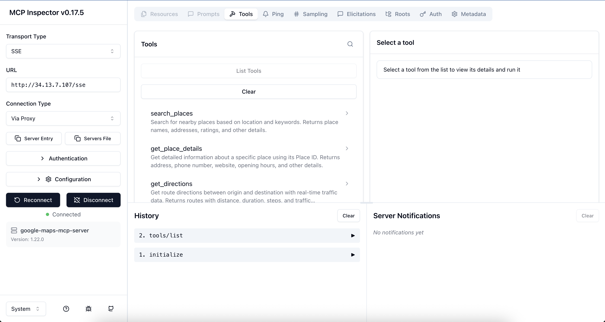
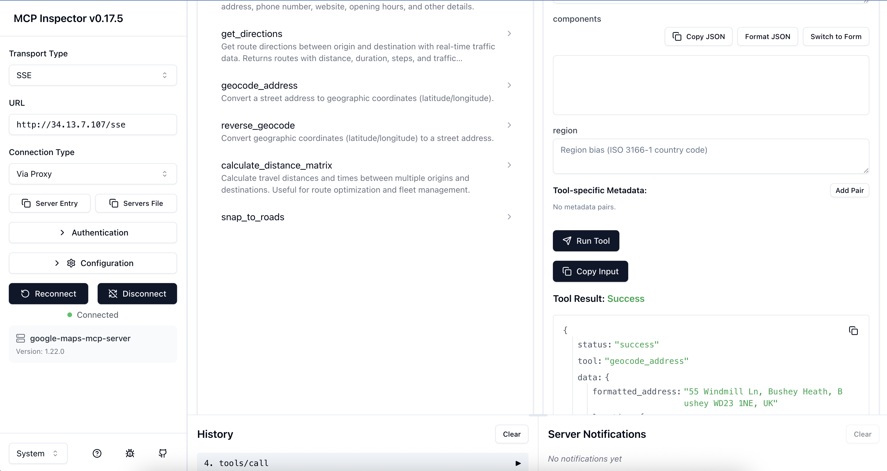

# Google Maps MCP Server

[](https://pypi.org/project/google-maps-mcp-server/)
[](https://pypi.org/project/google-maps-mcp-server/)
[](https://opensource.org/licenses/Apache-2.0)
[](https://github.com/ettysekhon/google-maps-mcp-server/actions)
[](https://codecov.io/gh/ettysekhon/google-maps-mcp-server)
[](https://github.com/psf/black)
[](https://github.com/astral-sh/ruff)

**Production-ready Model Context Protocol (MCP) server for Google Maps Platform APIs.**

Empower your AI agents with real-world location intelligence: directions, places, geocoding, traffic analysis, and road network data—all through a standardised MCP interface.

---

## Features

- **Production-Ready**: Robust error handling, automatic retries with exponential backoff, structured logging
- **Universal Integration**: Works with Claude Desktop, Google ADK, and any MCP-compatible client
- **Comprehensive API Coverage**: 11 tools spanning all major Google Maps APIs
- **Type-Safe**: Full type annotations with Pydantic validation and mypy compliance
- **Zero Configuration**: Sensible defaults, works out of the box
- **Thoroughly Tested**: >90% code coverage with unit and integration tests
- **Docker Support**: Ready-to-deploy container images
- **Excellent Documentation**: Extensive examples, API reference, and best practices
- **Modern Python**: Built for Python 3.10+ using uv package manager

---

## Supported APIs & Tools

| API | Tool | Description | Use Cases |
|-----|------|-------------|-----------|
| **Places API** | `search_places` | Find points of interest near a location | Restaurant recommendations, gas station finder, POI search |
| **Places API** | `get_place_details` | Get comprehensive details for a place | Opening hours, websites, phone numbers, accessibility info |
| **Directions API** | `get_directions` | Get routes with real-time traffic | Route planning, ETA calculation, alternative routes |
| **Directions API** | `get_traffic_conditions` | Analyse real-time traffic congestion | Commute monitoring, delay estimation, fleet routing |
| **Geocoding API** | `geocode_address` | Convert addresses to coordinates | Address validation, location lookup |
| **Geocoding API** | `reverse_geocode` | Convert coordinates to addresses | Location identification, address lookup |
| **Distance Matrix API** | `calculate_distance_matrix` | Multi-origin/destination distances | Fleet routing, delivery optimisation, travel planning |
| **Roads API** | `snap_to_roads` | Snap GPS points to road network | GPS trace cleaning, route reconstruction |
| **Roads API** | `get_speed_limits` | Retrieve speed limit data | Fleet safety monitoring, compliance checking |
| **Elevation API** | `get_route_elevation_gain` | Calculate elevation gain and profile | Cycling/hiking planning, fuel efficiency |
| **Compound** | `calculate_route_safety_factors` | Assess route safety risks | Fleet safety, insurance scoring, driver assistance |

---

## Quick Start

### Prerequisites

- Python 3.10 or higher (3.14+ recommended)
- [Google Maps API key](https://developers.google.com/maps/documentation/javascript/get-api-key)
- [uv](https://docs.astral.sh/uv/) package manager (optional but recommended)

### Installation

#### Using uv (Recommended)

```bash
uv pip install google-maps-mcp-server
```

#### Using pip

```bash
pip install google-maps-mcp-server
```

#### From Source

```bash
git clone https://github.com/ettysekhon/google-maps-mcp-server.git
cd google-maps-mcp-server
uv sync
```

### Setup Google Maps API Key

1. Visit the [Google Cloud Console](https://console.cloud.google.com/)
2. Create a new project or select an existing one
3. Enable the following APIs:
   - Places API
   - Directions API
   - Geocoding API
   - Distance Matrix API
   - Roads API
4. Create credentials (API Key)
5. Restrict your API key (recommended):
   - Application restrictions: HTTP referrers or IP addresses
   - API restrictions: Select only the APIs listed above

### Configuration

Create a `.env` file in your working directory:

```bash
GOOGLE_MAPS_API_KEY=your_maps_api_key_here

LOG_LEVEL=INFO
MAX_RESULTS=20
```

Or set environment variables:

```bash
export GOOGLE_MAPS_API_KEY="your_maps_api_key_here"
```

### Run the Server

```bash
# Using the installed command
google-maps-mcp-server

# Or using Python module
python -m google_maps_mcp_server

# Or using uv
uv run google-maps-mcp-server
```

---

## Deployment

See [DEPLOYMENT.md](DEPLOYMENT.md) for full instructions, troubleshooting, and architecture details.

### Local Docker Testing

```bash
# Set your API key (or create a .env file)
export GOOGLE_MAPS_API_KEY=your-key

# Build and run
make docker-run

# Verify (in another terminal)
make verify-local
```

### GKE Deployment

```bash
# Set environment
export GOOGLE_CLOUD_PROJECT=your-project-id
export GOOGLE_CLOUD_REGION=europe-west2

# First time: create secret
make deploy-secret

# Deploy (build, push, apply)
make deploy-all

# Check status
make deploy-status
```

### Redeploying After Code Changes

```bash
# Rebuild and push new image
make deploy-build

# Force pod to pull new image
kubectl delete pod -l app=google-maps-mcp-server

# Watch for new pod to be ready
kubectl get pods -l app=google-maps-mcp-server -w
```

### Testing with MCP Inspector

Verify your deployment using the official MCP Inspector:

```bash
npx @modelcontextprotocol/inspector
```

- Transport Type: **SSE**
- URL: `http://<EXTERNAL-IP>/sse` (or `http://localhost:8080/sse` for local)
- Should see 11 tools listed





Run `make help` to see all available commands.

---

## Usage Examples

### With Claude Desktop

Add to your Claude Desktop configuration file:

**macOS**: `~/Library/Application Support/Claude/claude_desktop_config.json`
**Windows**: `%APPDATA%\Claude\claude_desktop_config.json`

```json
{
  "mcpServers": {
    "google-maps": {
      "command": "uvx",
      "args": ["google-maps-mcp-server"],
      "env": {
        "GOOGLE_MAPS_API_KEY": "your_api_key_here"
      }
    }
  }
}
```

Or if installed globally:

```json
{
  "mcpServers": {
    "google-maps": {
      "command": "google-maps-mcp-server",
      "env": {
        "GOOGLE_MAPS_API_KEY": "your_api_key_here"
      }
    }
  }
}
```

Now you can ask Claude:

- *"Find the best coffee shops near The Strand, London"*
- *"What are the opening hours for the Natural History Museum?"*
- *"How is the traffic from London to Manchester right now?"*
- *"Is the route from Edinburgh to Glasgow safe for night driving?"*
- *"Convert the address '10 Downing Street, London' to coordinates"*
- *"What's the address for coordinates 51.5074, -0.1278?"*
- *"Find petrol stations within 2km of my current location at 51.5074,-0.1278"*

### With Google ADK

```python
from google.adk.agents import Agent
from google.adk.tools.mcp_tool import MCPToolset
from mcp.client.stdio import StdioServerParameters

async def create_location_agent():
    # Connect to Google Maps MCP server
    maps_tools = await MCPToolset.from_server(
        connection_params=StdioServerParameters(
            command='google-maps-mcp-server',
            env={"GOOGLE_MAPS_API_KEY": "your_api_key_here"}
        )
    )

    # Create agent with Maps tools
    agent = Agent(
        name="location_intelligence_agent",
        model="gemini-2.0-flash",
        instruction="""You are a location intelligence assistant with access to
        Google Maps data. Help users with directions, place searches, and location queries.""",
        tools=[maps_tools]
    )

    return agent

# Use the agent
agent = await create_location_agent()
response = await agent.run("Find Italian restaurants near Hyde Park, London")
print(response)
```

### Programmatic Usage

```python
import asyncio
from google_maps_mcp_server import GoogleMapsMCPServer, Settings

async def main():
    # Initialise with custom settings
    settings = Settings(
        google_maps_api_key="your_api_key_here",
        log_level="DEBUG",
        max_results=10
    )

    server = GoogleMapsMCPServer(settings)

    # Run the server
    await server.run()

if __name__ == "__main__":
    asyncio.run(main())
```

### Direct Tool Usage

```python
from google_maps_mcp_server.tools import PlacesTool, DirectionsTool
from google_maps_mcp_server.config import Settings

async def find_nearby_restaurants():
    settings = Settings(google_maps_api_key="your_key")
    places_tool = PlacesTool(settings)

    result = await places_tool.execute({
        "location": "51.5118,-0.1175",  # The Strand, London
        "keyword": "pizza",
        "radius": 1000
    })

    print(f"Found {result['data']['count']} pizza places")
    for place in result['data']['places']:
        print(f"- {place['name']}: {place['rating']}⭐")

asyncio.run(find_nearby_restaurants())
```

### Docker Usage

```bash
# Build the image
docker build -t google-maps-mcp .

# Run the container
docker run -it \
  -e GOOGLE_MAPS_API_KEY=your_maps_key_here \
  google-maps-mcp

# Or use docker-compose
docker-compose up
```

---

## Configuration Options

All configuration can be set via environment variables or `.env` file:

| Variable | Type | Default | Description |
|----------|------|---------|-------------|
| `GOOGLE_MAPS_API_KEY` | string | **required** | Google Maps Platform API key (for Maps tools) |
| `LOG_LEVEL` | string | `INFO` | Logging level (DEBUG, INFO, WARNING, ERROR, CRITICAL) |
| `MAX_RESULTS` | integer | `20` | Maximum results to return (1-60) |
| `DEFAULT_RADIUS_METERS` | integer | `5000` | Default search radius in meters |
| `MAX_RADIUS_METERS` | integer | `50000` | Maximum allowed search radius |
| `MAX_RETRIES` | integer | `3` | Maximum retry attempts for failed requests |
| `RETRY_MIN_WAIT` | float | `1.0` | Minimum wait between retries (seconds) |
| `RETRY_MAX_WAIT` | float | `10.0` | Maximum wait between retries (seconds) |

---

## Tool Documentation

### `search_places`

Find places near a location.

**Parameters:**

- `location` (required): Coordinates as "lat,lng" or address string
- `keyword` (required): Search keyword (e.g., "restaurant", "petrol station")
- `radius` (optional): Search radius in meters (default: 5000, max: 50000)
- `type` (optional): Place type filter (e.g., "restaurant", "gas_station")

**Example:**

```json
{
  "location": "51.5118,-0.1175",
  "keyword": "coffee shop",
  "radius": 1000,
  "type": "cafe"
}
```

### `get_place_details`

Get detailed information about a specific place.

**Parameters:**

- `place_id` (required): The unique Place ID
- `fields` (optional): Specific fields to retrieve (e.g., ["name", "phone", "hours"])

**Example:**

```json
{
  "place_id": "ChIJN1t_tDeuEmsRUsoyG83frY4",
  "fields": ["name", "website", "hours"]
}
```

### `get_directions`

Get route directions with real-time traffic.

**Parameters:**

- `origin` (required): Start location (address or coordinates)
- `destination` (required): End location (address or coordinates)
- `mode` (optional): Travel mode - "driving" (default), "walking", "bicycling", "transit"
- `departure_time` (optional): ISO 8601 timestamp for traffic estimation
- `alternatives` (optional): Return alternative routes (default: true)
- `avoid` (optional): Features to avoid - ["tolls", "highways", "ferries", "indoor"]
- `traffic_model` (optional): "best_guess" (default), "optimistic", "pessimistic"

**Example:**

```json
{
  "origin": "London, UK",
  "destination": "Manchester, UK",
  "mode": "driving",
  "alternatives": true,
  "avoid": ["tolls"]
}
```

### `get_traffic_conditions`

Analyze real-time traffic conditions between two locations.

**Parameters:**

- `origin` (required): Starting location
- `destination` (required): Ending location
- `departure_time` (optional): ISO 8601 timestamp (defaults to now)
- `traffic_model` (optional): "best_guess" (default), "optimistic", "pessimistic"

**Example:**

```json
{
  "origin": "London, UK",
  "destination": "Oxford, UK",
  "traffic_model": "best_guess"
}
```

### `geocode_address`

Convert an address to coordinates.

**Parameters:**

- `address` (required): Street address to geocode
- `components` (optional): Component filters (e.g., {"country": "GB"})
- `region` (optional): Region bias (ISO 3166-1 country code)

**Example:**

```json
{
  "address": "10 Downing Street, London, UK"
}
```

### `reverse_geocode`

Convert coordinates to an address.

**Parameters:**

- `lat` (required): Latitude (-90 to 90)
- `lng` (required): Longitude (-180 to 180)
- `result_type` (optional): Filter by result types

**Example:**

```json
{
  "lat": 51.5034,
  "lng": -0.1276
}
```

### `calculate_distance_matrix`

Calculate distances and times between multiple locations.

**Parameters:**

- `origins` (required): Array of origin locations
- `destinations` (required): Array of destination locations
- `mode` (optional): Travel mode (default: "driving")
- `avoid` (optional): Features to avoid
- `units` (optional): "metric" (default) or "imperial"

**Example:**

```json
{
  "origins": ["London, UK", "Manchester, UK"],
  "destinations": ["Birmingham, UK", "Leeds, UK"],
  "mode": "driving"
}
```

### `snap_to_roads`

Snap GPS coordinates to the nearest road.

**Parameters:**

- `path` (required): Array of GPS points with lat/lng (2-100 points)
- `interpolate` (optional): Fill gaps between points (default: true)

**Example:**

```json
{
  "path": [
    {"lat": 51.5034, "lng": -0.1276},
    {"lat": 51.5035, "lng": -0.1275}
  ],
  "interpolate": true
}
```

### `get_speed_limits`

Get speed limit data for road segments.

**Parameters:**

- `place_ids` (required): Array of place IDs from snap_to_roads

**Example:**

```json
{
  "place_ids": ["ChIJwQ2rKwAEdkgRo7h2RYD1oUM"]
}
```

### `calculate_route_safety_factors`

Calculate safety scores for a route based on traffic, road conditions, and speed limits.

**Parameters:**

- `origin` (required): Starting location
- `destination` (required): Ending location
- `departure_time` (optional): ISO 8601 timestamp (defaults to now)
- `traffic_model` (optional): "best_guess", "optimistic", "pessimistic" (default)

**Example:**

```json
{
  "origin": "London, UK",
  "destination": "Oxford, UK",
  "departure_time": "2023-10-27T23:00:00Z",
  "traffic_model": "pessimistic"
}
```

### `get_route_elevation_gain`

Calculate elevation gain and retrieve elevation profile for a route.

**Parameters:**

- `origin` (required): Starting location
- `destination` (required): Ending location
- `mode` (optional): "driving", "walking", "bicycling" (default)
- `samples` (optional): Number of elevation samples (default: 50, max: 512)

**Example:**

```json
{
  "origin": "London, UK",
  "destination": "Brighton, UK",
  "mode": "bicycling",
  "samples": 100
}
```

---

## Development

### Setup Development Environment

```bash
# Clone the repository
git clone https://github.com/ettysekhon/google-maps-mcp-server.git
cd google-maps-mcp-server

# Install uv if you haven't already
curl -LsSf https://astral.sh/uv/install.sh | sh

# Install dependencies with dev extras
uv sync --extra dev

# Set up pre-commit hooks
uv run pre-commit install
```

### Run Tests

```bash
# Run all tests
uv run pytest

# Run with coverage
uv run pytest --cov=src --cov-report=html

# Run only unit tests
uv run pytest -m "not integration"

# Run specific test file
uv run pytest tests/unit/test_places.py

# Run with verbose output
uv run pytest -v
```

### Code Quality

```bash
# Format code
uv run black src tests

# Lint code
uv run ruff check src tests

# Fix linting issues automatically
uv run ruff check src tests --fix

# Type checking
uv run mypy src

# Run all checks
uv run black src tests && \
uv run ruff check src tests && \
uv run mypy src && \
uv run pytest
```

### Building and Publishing

```bash
# Build package
uv build

# Publish to PyPI (requires authentication)
uv publish

# Build Docker image
docker build -t google-maps-mcp-server:latest .
```

---

## Contributing

We welcome contributions! Please see [CONTRIBUTING.md](docs/CONTRIBUTING.md) for guidelines.

### Quick Contribution Guide

1. Fork the repository
2. Create a feature branch (`git checkout -b feature/amazing-feature`)
3. Make your changes
4. Add tests for your changes
5. Ensure all tests pass (`uv run pytest`)
6. Commit your changes (`git commit -m 'Add amazing feature'`)
7. Push to the branch (`git push origin feature/amazing-feature`)
8. Open a Pull Request

---

## API Limits and Pricing

This MCP server uses Google Maps Platform APIs which have the following considerations:

- **Free Tier**: $200 monthly credit (covers ~28,000 geocoding requests or ~40,000 directions requests)
- **Pay-as-you-go**: Pricing varies by API
- **Rate Limits**: Default quotas apply; can be increased via Google Cloud Console

**Cost Optimisation Tips:**

- Cache results when appropriate
- Use `alternatives=false` for directions when not needed
- Limit `max_results` for place searches
- Implement client-side caching for repeated queries

See [Google Maps Platform Pricing](https://mapsplatform.google.com/pricing/) for details.

---

## Security Best Practices

1. **API Key Security:**
   - Never commit API keys to version control
   - Use environment variables or secret management
   - Restrict API keys by API, HTTP referrer, or IP address
   - Rotate keys regularly

2. **API Key Restrictions (Recommended):**

   ```text
   Application restrictions: HTTP referrers or IP addresses
   API restrictions:
     - Places API
     - Directions API
     - Geocoding API
     - Distance Matrix API
     - Roads API
   ```

3. **Monitoring:**
   - Enable billing alerts in Google Cloud Console
   - Monitor API usage regularly
   - Set up quota alerts

---

## Troubleshooting

### Common Issues

**Problem:** `ValidationError: google_maps_api_key cannot be empty`

- **Solution:** Ensure `GOOGLE_MAPS_API_KEY` environment variable is set

**Problem:** `REQUEST_DENIED` error

- **Solution:** Enable required APIs in Google Cloud Console and check API key restrictions

**Problem:** `OVER_QUERY_LIMIT` error

- **Solution:** You've exceeded API quota. Check usage in Google Cloud Console or implement rate limiting

**Problem:** Server won't start

- **Solution:** Check logs for errors, verify Python version (3.10+), ensure all dependencies installed

### Enable Debug Logging

```bash
export LOG_LEVEL=DEBUG
google-maps-mcp-server
```

### Getting Help

- [Full Documentation](docs/)
- [GitHub Discussions](https://github.com/ettysekhon/google-maps-mcp-server/discussions)
- [Issue Tracker](https://github.com/ettysekhon/google-maps-mcp-server/issues)
- <etty.sekhon@gmail.com>

---

## License

This project is licensed under the Apache License 2.0 - see the [LICENSE](LICENSE) file for details.

---

## Acknowledgments

- Built with [MCP](https://modelcontextprotocol.io) by Anthropic
- Powered by [Google Maps Platform](https://developers.google.com/maps)
- Developed using [uv](https://docs.astral.sh/uv/) by Astral
- Inspired by the amazing MCP community
